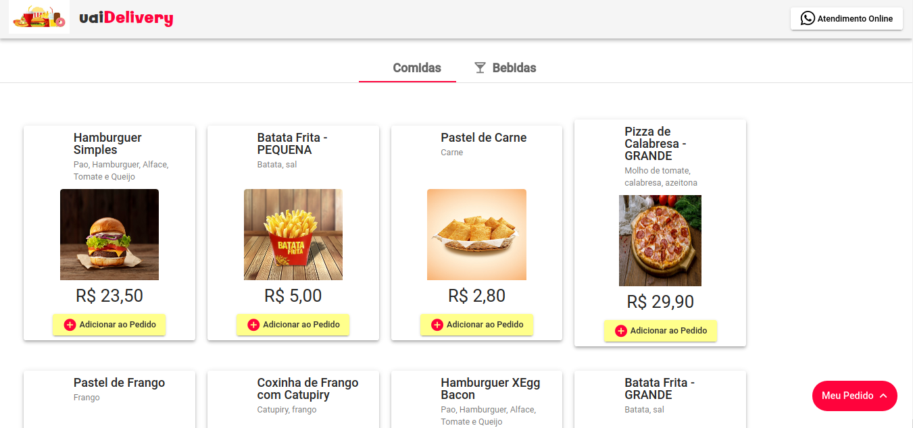
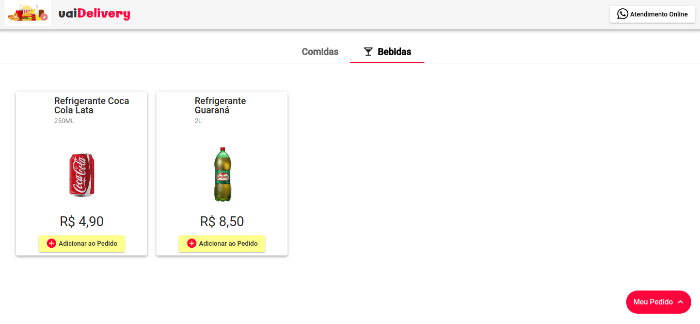
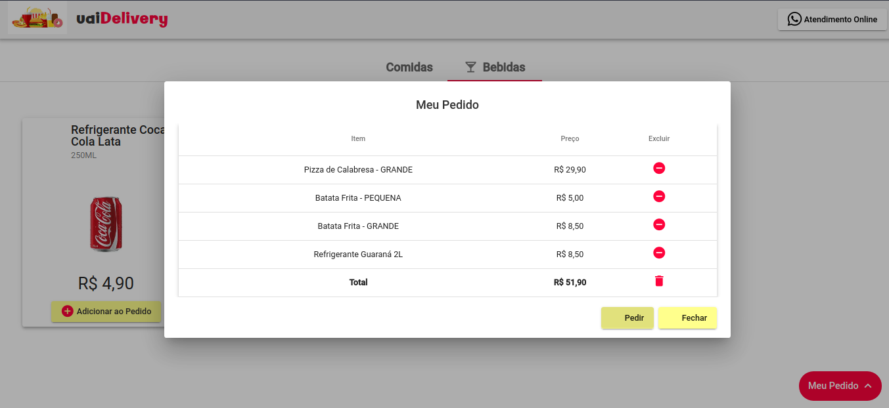
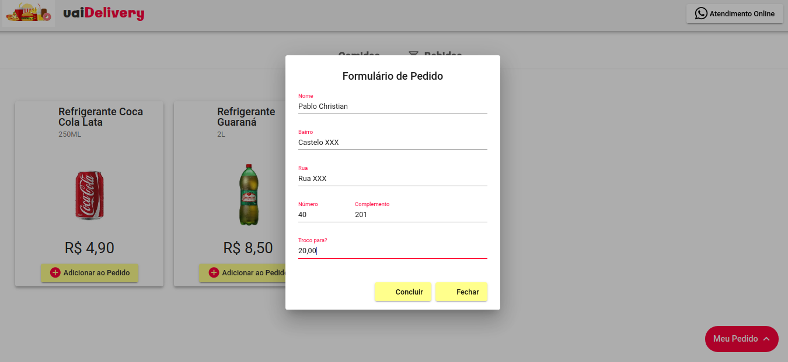

<h1>Uai Food Delivery</h1>

</img>

Food delivery application made in Angular and NodeJS

## Tecnologias 
<ul>
<li>Angular</li>
<li>Angular Material</li>
<li>NodeJS + NPM + ExpressJS + Nodemon</li>
<li>TypeScript</li>
<li>HTML</li>
<li>CSS</li>
</ul>

## Imagens

#### Home - Food Group

#### Home - Drink Group

#### Order List

#### Order Formulary

#### Executing the application

Download the project, type `npm install` and then `ng serve` to start the application. Navigate to URL `http://localhost:4200/`.

#### Executing the Node server

Download the project, acess the directory 'server', type `npm install` and then `npm start` to start the application. Navigate to URL `http://localhost:3100/api/produtos`.
